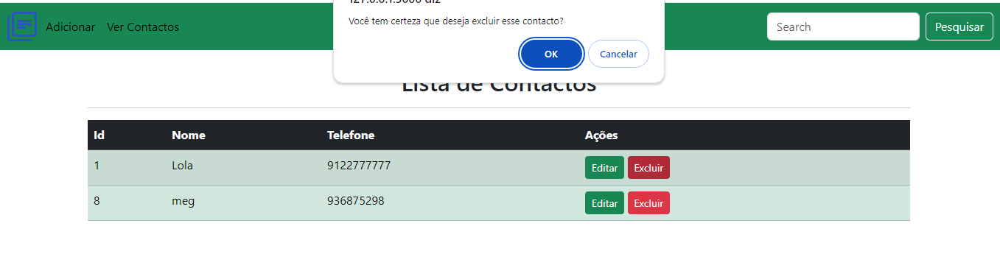
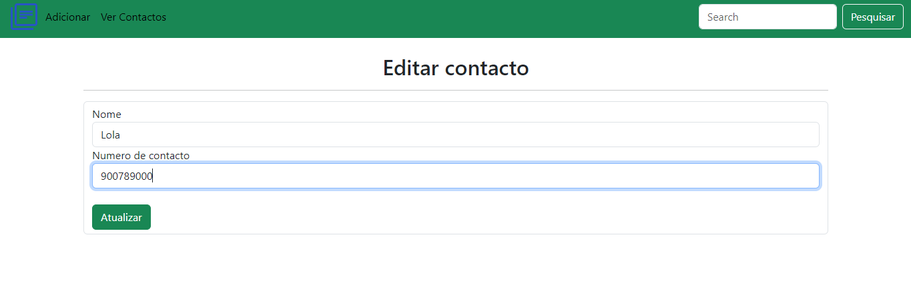
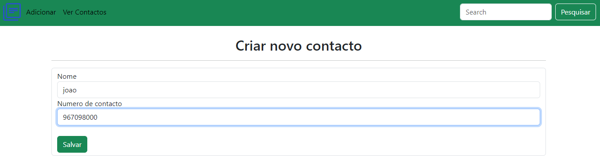
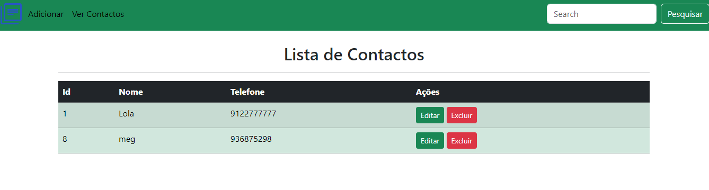

Projeto de Agenda de Contatos
Este é um projeto de uma aplicação web simples para gerenciar uma agenda de contatos, desenvolvido com Flask e SQLAlchemy. A aplicação permite adicionar, atualizar, deletar e pesquisar contatos.

Sumário
Instalação
Uso
Funcionalidades
Estrutura do Projeto
Licença
Contato
Instalação
Para configurar e executar este projeto em sua máquina local, siga as etapas abaixo:

Clone este repositório:

sh
Copiar código
git clone https://github.com/seu-usuario/agenda-de-contatos.git
cd agenda-de-contatos
Crie um ambiente virtual e instale as dependências:

sh
Copiar código
python3 -m venv venv
source venv/bin/activate  # Linux ou macOS
venv\Scripts\activate  # Windows
pip install -r requirements.txt
Inicialize o banco de dados:

sh
Copiar código
flask db init
flask db migrate
flask db upgrade
Execute a aplicação:

sh
Copiar código
flask run
Uso
Acesse http://127.0.0.1:5000/ em seu navegador para visualizar a aplicação.

Adicionar Contato
Navegue até http://127.0.0.1:5000/cria_contacto para adicionar um novo contato.
Atualizar Contato
Navegue até http://127.0.0.1:5000/<id>/atualiza_contactos para atualizar um contato existente.
Deletar Contato
Navegue até http://127.0.0.1:5000/<id>/delete_contactos para deletar um contato.
Pesquisar Contato
Navegue até http://127.0.0.1:5000/pesquisar para pesquisar por contatos.

Funcionalidades
Adicionar Contato: Adiciona um novo contato com nome e telefone.
Atualizar Contato: Atualiza as informações de um contato existente.
Deletar Contato: Remove um contato da lista.
Pesquisar Contato: Busca contatos por nome.
Estrutura do Projeto
plaintext
Copiar código
.
├── app.py
├── controller
│   └── controller.py
├── models
│   └── model.py
├── templates
│   ├── agenda.html
│   ├── novo_contacto.html
│   ├── atualiza_contactos.html
│   └── pesquisar.html
├── static
│   └── css
│       └── styles.css
├── requirements.txt
└── README.md

Descrição dos Arquivos
app.py: Arquivo principal da aplicação Flask.
controller/controller.py: Contém as funções de controle que gerenciam as rotas da aplicação.
models/model.py: Define o modelo de dados utilizando SQLAlchemy.
templates/: Contém os templates HTML da aplicação.
static/css/styles.css: Contém os estilos CSS da aplicação.
Licença
Este projeto está licenciado sob a Licença MIT - veja o arquivo LICENSE.md para mais detalhes.

Contato
Desenvolvedor - ThalitaMoia- thanalistati@outlook.com

## Screenshots

### Página Inicial

### Adicionar Contato

### Atualizar Contato

### Deletar Contato

Link do Projeto: https://github.com/thalitamoia/MinhaAgenda
